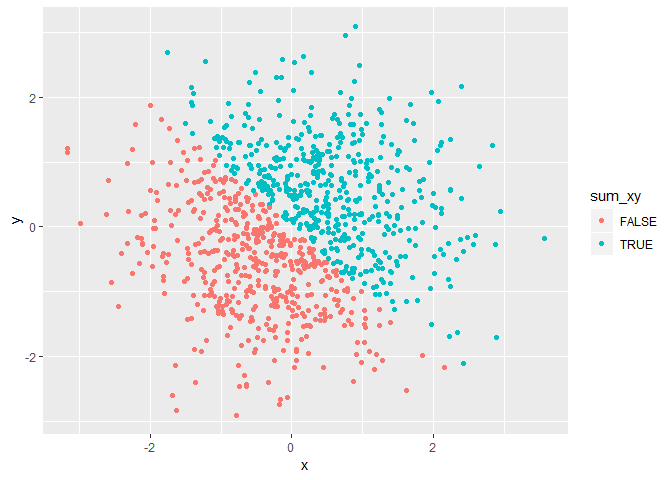
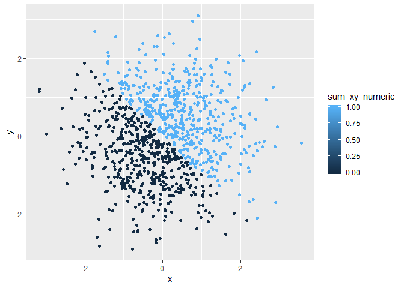
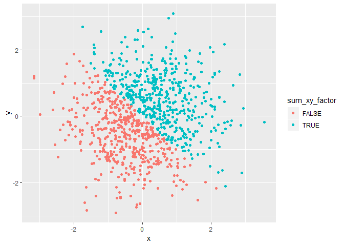

Homework 1
================
Rachel Tsong
2018-21-09

Problem 1
=========

Step 1
------

Load tidyverse

``` r
library(tidyverse)
```

    ## -- Attaching packages -------------------------------- tidyverse 1.2.1 --

    ## v ggplot2 3.0.0     v purrr   0.2.5
    ## v tibble  1.4.2     v dplyr   0.7.6
    ## v tidyr   0.8.1     v stringr 1.3.1
    ## v readr   1.1.1     v forcats 0.3.0

    ## -- Conflicts ----------------------------------- tidyverse_conflicts() --
    ## x dplyr::filter() masks stats::filter()
    ## x dplyr::lag()    masks stats::lag()

Step 2
------

Create a random sample of size 10 from a uniform \[0,5\] distribution called "sample"

``` r
sample = runif(n = 10, min = 0, max = 5)
```

Step 3
------

Create dataframe called "problem1\_df"

``` r
vec_logical = sample > 2
vec_char = c("i", "made", "this", "character", "vector", "with", "length", "of", "ten", "yay")
vec_factor = factor(c("a", "a", "a", "a", "b", "b", "b", "b", "a", "b"))

problem1_df = tibble(
  sample,
  vec_logical,
  vec_char,
  vec_factor
  )
```

Here is the data frame:

    ## # A tibble: 10 x 4
    ##    sample vec_logical vec_char  vec_factor
    ##     <dbl> <lgl>       <chr>     <fct>     
    ##  1  3.99  TRUE        i         a         
    ##  2  0.221 FALSE       made      a         
    ##  3  2.94  TRUE        this      a         
    ##  4  1.01  FALSE       character a         
    ##  5  2.81  TRUE        vector    b         
    ##  6  3.57  TRUE        with      b         
    ##  7  2.04  TRUE        length    b         
    ##  8  1.23  FALSE       of        b         
    ##  9  4.17  TRUE        ten       a         
    ## 10  1.53  FALSE       yay       b

Can you take the mean?
----------------------

-   sample: yes, I can take the mean because it is a numerical vector
-   vec\_logical: yes, I can take the mean because R assigns TRUE and FALSE values of 1 and 0
-   vec\_char: no, I cannot take the mean because the vector is not numerical
-   vec\_factor: no, see above

Step 4
------

Test what happens when you convert variables to a different type

``` r
as.numeric(vec_logical)
as.numeric(vec_char)
as.numeric(vec_factor)
```

What happens?
-------------

-   vec\_logical converted to 1/0 for T/F
-   vec\_char changed to NA
-   vec\_factor converted to 1/2 for a/b

``` r
as.numeric(as.factor(vec_char))
```

    ##  [1]  2  4  7  1  8  9  3  5  6 10

``` r
as.numeric(as.character(vec_factor))
```

    ## Warning: NAs introduced by coercion

    ##  [1] NA NA NA NA NA NA NA NA NA NA

What happens?
-------------

-   Converting the character vector to a factor vector alphabetizes the vector, and converting this into a numeric vector assigns values to the cases based on this alphabetical order
-   Converting the character vector to a factor vector to a numeric vector creates a vector where all cases become NA

Problem 2
=========

Step 1
------

Create dataframe

``` r
x = rnorm(1000, 0 , 1)
y = rnorm(1000, 0 , 1)
sum_xy = x + y > 0
sum_xy_numeric = as.numeric(sum_xy)
sum_xy_factor = as.factor(sum_xy)

problem2_df = tibble(
  x,
  y,
  sum_xy,
  sum_xy_factor,
  sum_xy_numeric
)
```

Here is the data frame:

    ## # A tibble: 1,000 x 5
    ##          x       y sum_xy sum_xy_factor sum_xy_numeric
    ##      <dbl>   <dbl> <lgl>  <fct>                  <dbl>
    ##  1 -1.23   -0.381  FALSE  FALSE                      0
    ##  2  0.175  -0.640  FALSE  FALSE                      0
    ##  3  0.175  -1.39   FALSE  FALSE                      0
    ##  4  0.465  -1.44   FALSE  FALSE                      0
    ##  5  0.0883  1.35   TRUE   TRUE                       1
    ##  6 -0.359  -1.51   FALSE  FALSE                      0
    ##  7 -0.419  -0.0912 FALSE  FALSE                      0
    ##  8  0.0316  0.557  TRUE   TRUE                       1
    ##  9 -1.07    1.22   TRUE   TRUE                       1
    ## 10  1.60   -0.458  TRUE   TRUE                       1
    ## # ... with 990 more rows

The size of the data set is 1000, 5. The variable x has a mean 0.0125895 and median -0.0103867. The proportion of cases for which the logical vector sum\_xy is true is 0.502.

Step 2
------

Make scatterplots of y vs x

``` r
plot_df = tibble(x, y)

ggplot(plot_df, aes(x = x, y = y, color = sum_xy)) + geom_point()
```



``` r
ggplot(plot_df, aes(x = x, y = y, color = sum_xy_numeric)) + geom_point()
```



``` r
ggplot(plot_df, aes(x = x, y = y, color = sum_xy_factor)) + geom_point()
```



For the logical and factor vector, the plots just have 2 colors for each of the 2 options, but for the numeric vector, the values are assigned to a color gradient.

Step 3
------

Save first scatterplot

``` r
ggsave("hw1_scatterplot.pdf", ggplot(plot_df, aes(x = x, y = y, color = sum_xy)) + geom_point())
```

    ## Saving 7 x 5 in image
